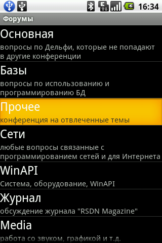
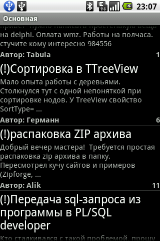
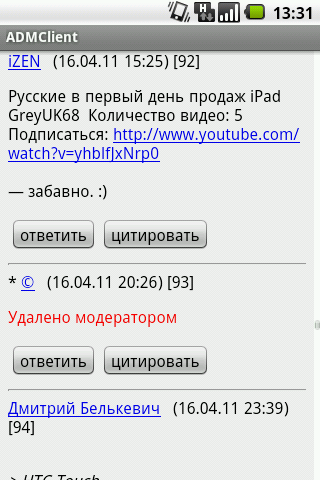
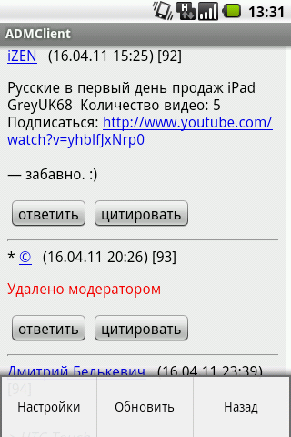
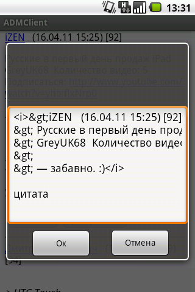
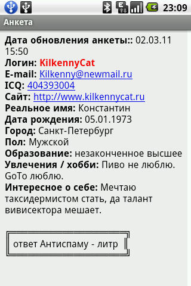
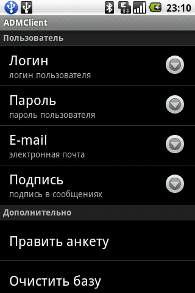

# ADMClient
**Android клиент форума "Мастера Delphi" [www.delphimaster.ru](http://www.delphimaster.ru)** сделанный в далеком 2011 году.
http://virex-84.narod.ru

# Описание
Клиент представляет из себя обычный виджет с четырьмя "активностями" (activity). При первом заходе в любую тему, загружает ее полностью (около 500 постов), и сохраняет всё в SQLite базу, чтобы в дальнейшем можно было читать темы без подключения к интернету (автономный режим), т.е. экономит internet траффик.

- 
- 
- 
- 
- 
- 
- 

# Особенности
- Клиент работает на **Android 2.2** и выше (**API8**). **Протестирован на: LG P500, Samsung Galaxy S III mini**.
- При первом запуске рекомендуется зайти в настройки (кнопка "меню" на телефоне), подправить логин и пароль под себя (пароль хранится в открытом виде!), либо ввести не зарегистрированный логин и стереть пароль (форум позволяет постить сообщения из неавторизированного логина).
- При первом запуске клиент создает базу "\data\data\com.virex.admclient\delphimaster.db" в телефоне, а если доступна SD карта - на ней.
- Рекомендуется все-таки использовать SD карту, т.к. база быстро растет и операционная система (на LG P500 уже при 1-2Мб) будет уведомлять о недостаточном количестве свободного места на телефоне.
- Установка виджета - через любой файловый менеджер, при включенной опции "Неизвестные источники. Разрешить установку приложений не из Android Маркет".

# Разработка
- jdk-7-ea-bin-b134-windows-i586-17_mar_2011 (java)
- eclipse-SDK-3.6.2-win32 (среда разработки)
- ADT-10.0.1.zip (плагин для Eclipse)
- Android SDK Tools v0.7 (SDK и эмулятор Android телефона)

